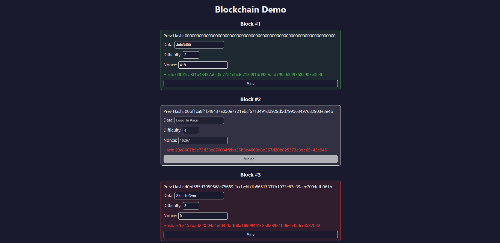

# Blockchain Visualizer

Este proyecto es un visualizador que permite ver cómo funciona una blockchain muy básica. Está hecho con Svlete y TypeScript.

Permite cambiar los datos de los bloques, independientemente de si se han minado o no, y ver cómo afecta a su hash. También permite minar nuevos bloques y ver cómo se calcula el hash de cada bloque.

A la hora de minar se ha añadido un retardo pequeño entre intento e intento para que se pueda ver mejor el proceso.

## Ejecutar el proyecto

- `pnpm install` para instalar las dependencias.
- `pnpm dev` para iniciar el servidor de desarrollo.
